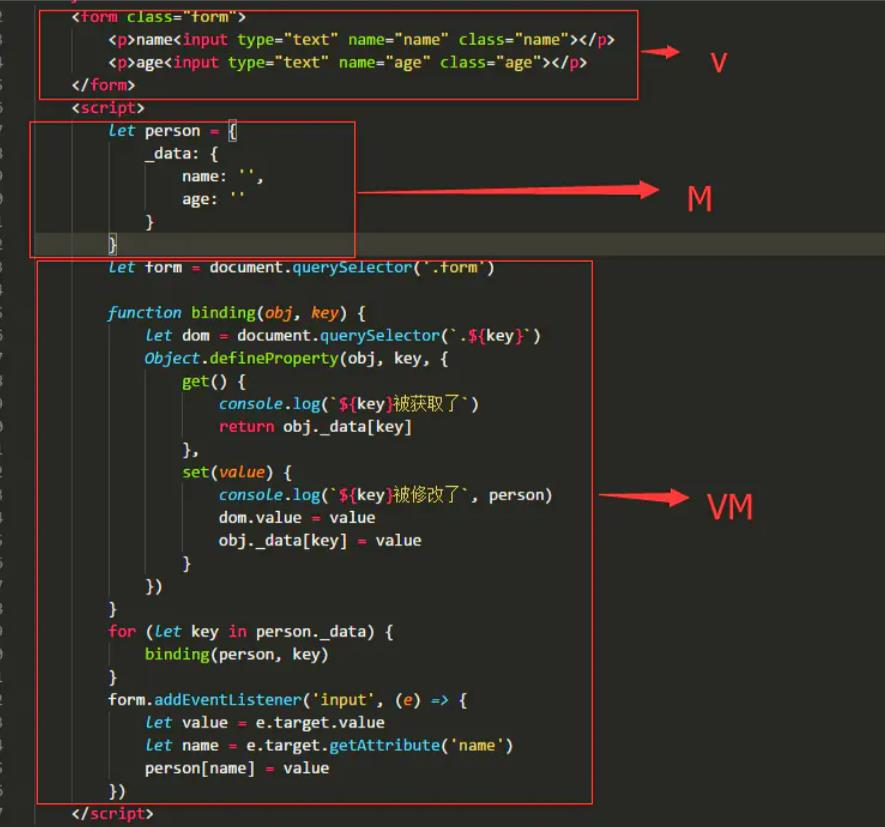
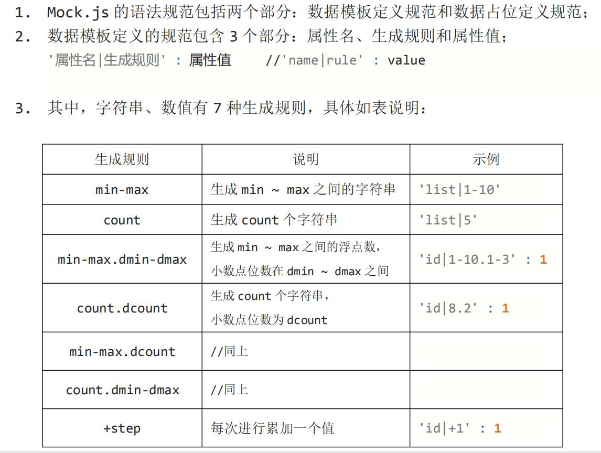
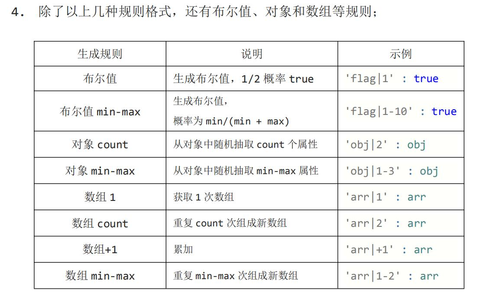
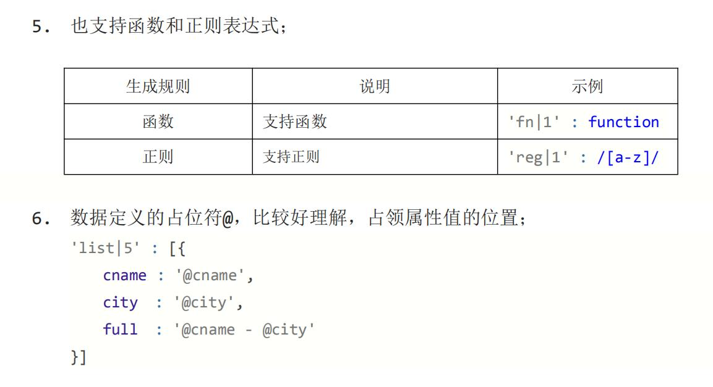
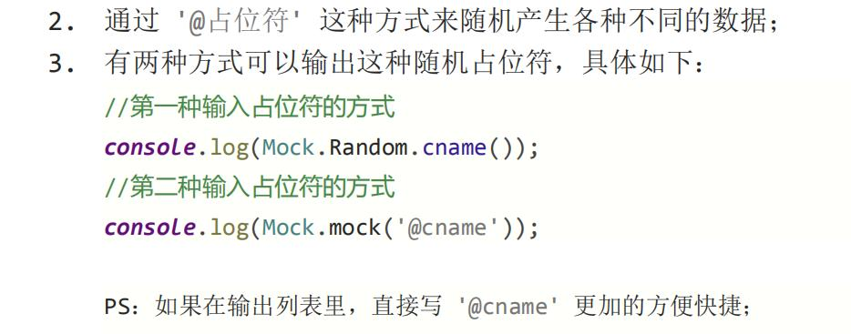
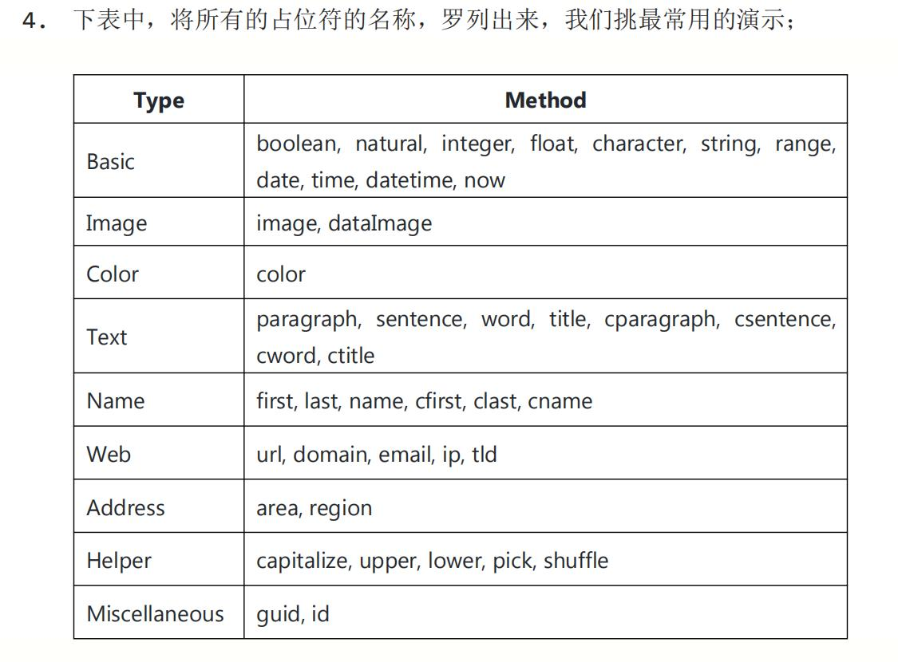
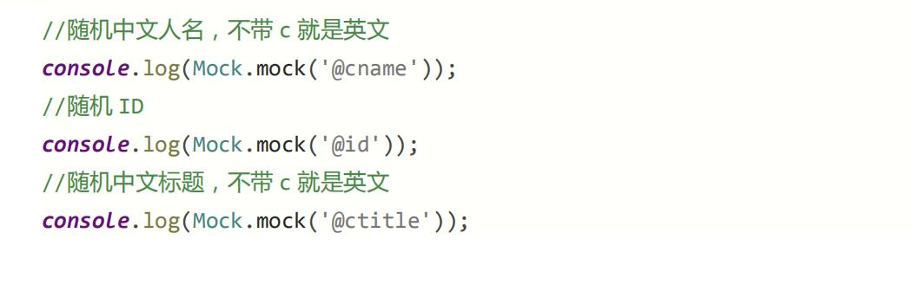
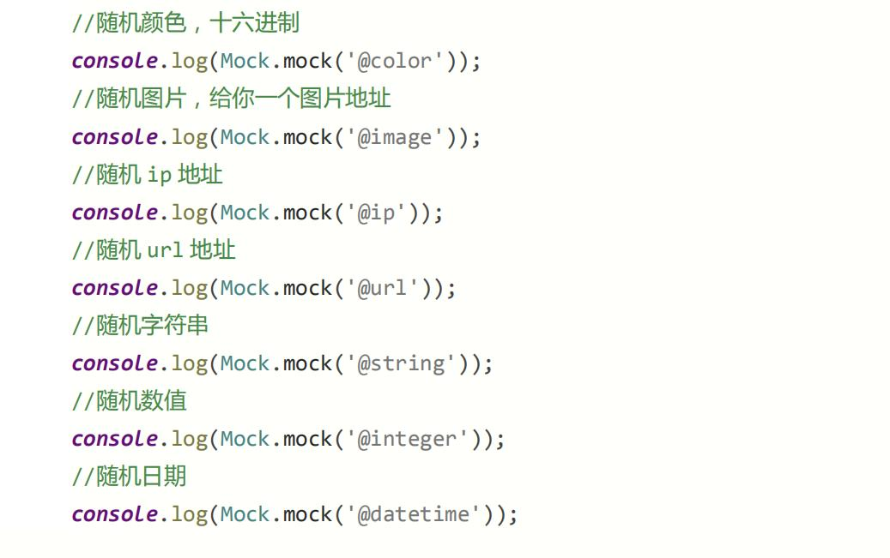
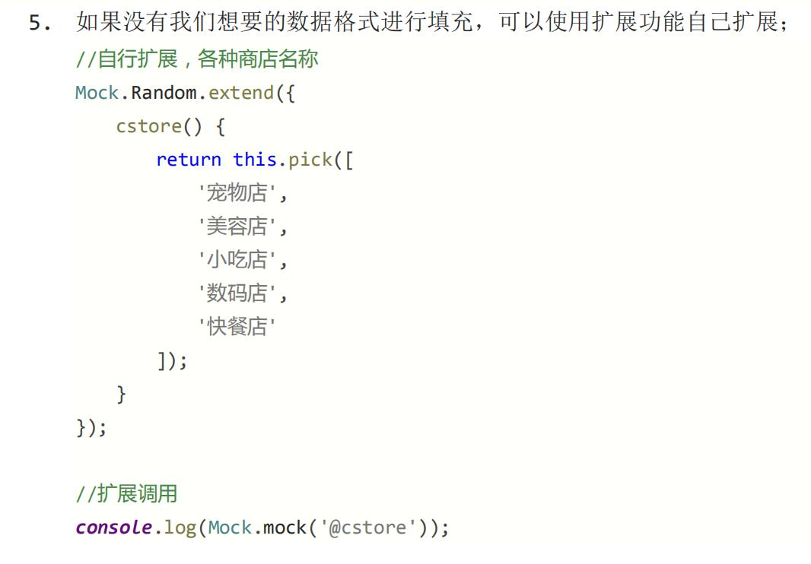

# vue

## vue
- 参考：<https://cn.vuejs.org/v2/guide/>

### 常用命令

#### 1.创建一个基于 webpack 模板的新项目
```shell script
vue init webpack 项目名称
```

#### 2.安装依赖
```shell script
cd 项目名称
npm install
```
ps：若项目中node_modules文件被删除，也可以使用该命令，能把package.json中的dependencies中所有依赖项都下载回来
建议：在使用 `npm install 包名` 时后边都加上 `--save` ，这样可以保存依赖项信息，
     可以在`package.json`中的`dependencies`中看到项目使用包的信息。

可以简写
```shell script
npm install --global vue-cli
npm i  name  -S   => npm install name --save
npm i  name  -D   => npm install name --save-dev
npm i  name  -g   全局安装
```
其中：

    i  就是 install的简写
    -S 就是 --save的简写 存入dependencies
    -D 就是 --save-dev  名称版本号存入package.json的devDependencies 开发环境

#### 3.安装vue-resource插件
```shell script
npm install vue-resource --save
```

     
#### 4.运行
```shell script
npm run serve
```
ps：这个需要package.json中`scripts`声明才行

#### 5.项目打包
```shell script
npm run build
```

### 常用文件

#### main.js
```vue
import Vue from 'vue'
import App from './App.vue'
import router from './router'
import store from './store'
import './plugins/element.js'
import './mock/index'
/**
 * axios是一个库，并不是vue中的第三方插件，使用时不能通过Vue.use()安装插件，需要在原型上进行绑定
 * import Vue from 'vue'
 * import axios from ‘axios’
 * Vue.prototype.$http = axios
 * https://cn.vuejs.org/v2/guide/plugins.html
 * */
import axios from './axios'

/**
 * vue-axios是将axios集成到Vue.js的小包装器，可以像插件一样进行安装
* */
import VueAxios from 'vue-axios'
// 引入axios，Vue.use第二个参数以及往后参数，都是插件中install()方法的参数，源码在`node_modules/vue-axios/src/index.js`
Vue.use(VueAxios, axios)

// 导入全局样式
import './assets/style/global.css'
// 导入图标样式
import './assets/fonts/iconfont.css'


// true为开发模式，会提供更多信息，false则为生产模式
Vue.config.productionTip = true

const obj = new Vue({
  router,
  store,
  // https://www.cnblogs.com/gopark/p/11445679.html
  render: h => h(App)
}).$mount('#app')
console.log(obj)
```

#### axios.js
```vue
import axios from 'axios'

const obj = axios.create({
  baseURL: 'https://cdn.liyanhui.com'
})

obj.interceptors.request.use(config => {
  config.headers.Authorization = window.sessionStorage.getItem('token')
  // console.log(config)
  return config
})
/**
axios.interceptors有两种，一是请求拦截，二是返回拦截。
一、请求拦截
使用场景
1.在请求时在请求参数上统一添加参数，


axios.interceptors.request.use(config=>{
  if(config.method=='post'){
    config.data = {
      ...config.data,
      "paramsName": params,
    }
  }else if(config.method=='get'){
    config.params = {
      "paramsName":params,
      ...config.params
    }
  }
  return config;
},err=>{
  return Promise.reject(err);
});
这样就可以将你的参数添加在请求当中了。

二、结果拦截
使用场景，验证token是否过期

axios.interceptors.response.use(response=>{
},error => {
  if(error.response.status === 401){
//对应的token过期的操作
  }
  return Promise.resolve(error.response)
});
这里要注意的是，看你前后端阅读401的返回，一般是报错，所以你的response是空的，你需要在error的回调里面去进行相关的处理。
*/

export default obj

```


#### router/index.js
```vue
import Vue from 'vue'
import VueRouter from 'vue-router'
import Login from '../views/Login'
import Home from '../views/Home'
import Welcome from '../components/Welcome'
import User from '../components/user/User'
import HelloWorld from '../components/HelloWorld'
Vue.use(VueRouter)

const routes = [
  {
    path: '/login',
    component: Login
  },
  {
    path: '/',
    name: 'Home',
    component: Home,
    redirect: '/Welcome',
    children: [
      {
        path: 'Welcome',
        name: 'Welcome',
        component: Welcome
      },
      {
        path: 'User/:id',
        name: 'User',
        component: User
      }
    ]
  },
  {
    path: '/HelloWorld',
    name: 'HelloWorld',
    component: HelloWorld
  }
]

const router = new VueRouter({
  routes
})

router.beforeEach((to, from, next) => {
  if (to.path === '/login') return next()
  const token = window.sessionStorage.getItem('token')
  if (!token) {
    // next()有实参会再次调用beforeEach
    return next('/login')
  }
  return next()
})

// router.afterEach((to,form)=>{
// 
// })

export default router
```

#### store/index.js
```vue
import Vue from 'vue'
import Vuex from 'vuex'

Vue.use(Vuex)

export default new Vuex.Store({
  state: {},
  mutations: {},
  actions: {},
  modules: {}
})

```

#### mock/index.js
```vue
import Mock from 'mockjs'
import User from './data/user'
import Menu from './data/menu'

const baseUrl = 'https://cdn.liyanhui.com'
// 拦截login
Mock.mock(baseUrl + '/data2.json', User.login)

// 拦截Menu
Mock.mock(baseUrl + '/menu.json', Menu.list)

// 拦截User-list
Mock.mock(baseUrl + '/user-list.json', User.list)

```

mock/data/user.js
```vue
// User模块数据
export default {
  login: {
    'status|1': true,
    'msg|10': '@csentence',
    data: '@cword',
    token: '@sentence'
  },
  list: {
    status: 200,
    msg: '@cword',
    data: {
      total_num: 3,
      'list|8-12': [
        {
          'id|+1': 1,
          role_name: '@cname',
          username: '@name',
          email: '@email',
          'status|1-3': true,
          create_time: '@time',
          mobile: '13699454940'
        }
      ]
    }
  }
}

```

### 安装node
- 下载安装即可
- 更改为淘宝的cnpm

```
# -g 为全局
npm install cnpm -g
```


- 安装vue-cli
```
cnpm install vue-cli -g
```
可以通过`vue list`查看可选的模板，一般选择webpack，在项目目录下进行`vue init webpack vue-name`命令，vue-name为项目名称

### 常见操作

#### v-系列

##### `v-bind`：绑定属性，`v-bind`可以简写为`:`
```
<div v-bind:id="dynamicId"></div>
// 冒号:后为属性，dynamicId和isButtonDisabled为`data()`返回对象的键
<button v-bind:disabled="isButtonDisabled">Button</button>
// 从 2.6.0 开始，可以用方括号括起来的 JavaScript 表达式作为一个指令的参数：
// 建议用计算属性替代这种复杂表达式
<a v-bind:[attributeName]="url"> ... </a>
```

##### `v-once`：一次性绑定，数据更改，不会更新视图
例：`<span v-once>这个将不会改变: {{ msg }}</span>`

##### `v-html`：依然是绑定属性，属性是原生html,`v-html`所在标签包裹属性值（html）
例：
```
// `rawHtml`为`data()`返回对象的键
<p>Using v-html directive: <span v-html="rawHtml"></span></p>
```

##### `v-model`：双向绑定，即model影响view，view的输入框内容也能改变model

```vue
<template>
  <div id="app">
    <input v-model="message" placeholder="edit me">
    <p>Message is: {{ message }}</p>
  </div>
</template>

<script>
export default {
  name: 'app',
  data () {
    return {
      message: ''
    }
  },
  components: {},
  methods: {}
}
</script>
```

##### `v-on`：为事件绑定方法，简写`@`
```
// doSomething是methods中的方法
<a v-on:click="doSomething">...</a>
// 修饰符 (modifier) 是以半角句号 . 指明的特殊后缀，用于指出一个指令应该以特殊方式绑定。
// 例如，.prevent 修饰符告诉 v-on 指令对于触发的事件调用 event.preventDefault()
<form action="/" v-on:submit.prevent="onSubmit">
    <input type="submit" value="提交">
</form>
```

##### `v-for`：循环
```vue
<template>
  <div id="app">
    <ul id="example-1">
      <li v-for="item in items" :key="item.message">
        {{ item.message }}
      </li>
    </ul>
  </div>
</template>

<script>
  export default {
    name: 'app',
    data() {
      return {
        items: [
          {message:"first"},
          {message:"second"},
          {message:"third"}
        ]
      }
    },
    components: {},
    methods: {}
  }
</script>
```

##### `v-if`和`v-else-if`以及`v-else`：
```vue
<template>
  <div id="app">
    <div v-if="type === 'login'">
      <label>Login</label>
      <!--主要：`key`属性的值保持唯一，是为了让vue切换元素时重新渲染，不然vue为了效率，会重复利用已渲染元素-->
      <input placeholder="Enter your login" key="login-input">
    </div>
    <div v-else-if="type === 'register'">
      <label>Register</label>
      <input placeholder="Enter your register" key="register-input">
    </div>
    <div v-else>
      <label>Else</label>
      <input placeholder="Enter your else" key="else-input">
    </div>

    类型：<input v-model="type">
  </div>
</template>

<script>
  export default {
    name: 'app',
    data() {
      return {
        type:'login'
      }
    },
    components: {},
    methods: {}
  }
</script>
```
备注：**永远不要把 v-if 和 v-for 同时用在同一个元素上。**

一般我们在两种常见的情况下会倾向于这样做：

为了过滤一个列表中的项目 (比如 v-for="user in users" v-if="user.isActive")。
在这种情形下，请将 users 替换为一个计算属性 (比如 activeUsers)，让其返回过滤后的列表。

为了避免渲染本应该被隐藏的列表 (比如 v-for="user in users" v-if="shouldShowUsers")。
这种情形下，请将 v-if 移动至容器元素上 (比如 ul、ol)。这个意思是shouldShowUsers决定了整个users还显不显示


##### `v-slot`可以简写为`#`
ps：查看 常见操作->插槽

##### `v-show`
```vue
<h1 v-show="ok">Hello!</h1>
```
ps：带有 v-show 的元素始终会被渲染并保留在 DOM 中。v-show 只是简单地切换元素的 CSS property display


#### 计算属性，方法和侦听器
- 计算属性：依赖于常规属性（相当于监听常规属性值），如果依赖属性值变化，则重新计算，不然多次调用计算属性，也只是调用缓存值而已，不会重新计算
- 方法：即methods中的方法，也可以使用`{{}}`调用，但每次调用都会重新计算
- 侦听器：watch中的方法，监听具体属性，可以获取原值和新值，继而进行操作
```html
<template>
    <div>
        <p>{{showTime()}}</p>
        <input type="text" v-model:value="input_val"><span>{{showInputVal}}</span>
        <p>{{pending}}</p>
    </div>
</template>
<script>
    export default {
        name: 'App',
        data() {
            return {
                input_val: '就职',
                pending:'等待中'
            }
        },
        methods: {
            // 每次调用方法，都会重新计算，不会缓存
            showTime() {
                return '页面加载于 ' + new Date().toLocaleString();
            },
        },
        computed: {
            // 计算属性可以依赖于具体属性，但计算属性名字与依赖的属性名称没关系
            showInputVal: function () {
                return this.input_val + '--computed';
            }
        },
        watch:{
            // 侦听器的键就是侦听的具体属性名称
            input_val:function (new_val,old_val) {
                console.log(new_val, old_val);
                this.pending = '更改中';
                setTimeout(()=>{this.pending='更改完'},1000);
            }
        }

    }
</script>
```

#### Class 与 Style 绑定
说明：vue对于Class 与 Style 绑定做了增强处理，可以为对象和数组
- 为对象：则下标是类名或者style属性名，值为绑定属性值
- 为数组：则数组元素为类名或者style对象(上一行那种对象)，感觉上不建议采用这种
```html
<template>
    <div>
        <p v-bind:class="classObject" :style="styleObject">类名-样式-绑定</p>
        <p v-bind:class="classArr" :style="[styleObject,styleObject2]">类名-样式-绑定</p>
    </div>
</template>
<script>
    export default {
        name: 'App',
        props: ['list'],
        data() {
            return {
                classObject: {
                    firstClass: true,
                    secondClass: true,
                },
                classArr:['one','two'],
                styleObject: {
                    'font-size': '14px',
                    'color': 'red'
                },
                styleObject2: {
                    'margin': '1px'
                }
            }
        }


    }
</script>
```
#### 条件渲染

```html
<template>
        <div>
            <div v-if="type==='login'">
                <!--key可以省略或相同，代表和else那里的input是同一个，切换时input内值保留；key值不同，则input不同-->
                登录 <input type="text" value="" key="login-key">
            </div>
            <div v-else>
                注册 <input type="text" value="" key="login-key">
            </div>
            <button @click="changeBtn">切换</button>
        </div>
</template>

<script>
    export default {
        name: "Login",
        data() {
            return {
                type: 'login'
            };
        },
        methods: {
            changeBtn: function () {
                this.type = (this.type === 'login') ? '' : 'login';
            }
        }
    }
</script>
```
v-if vs v-show
v-if 是“真正”的条件渲染，因为它会确保在切换过程中条件块内的事件监听器和子组件适当地被销毁和重建。

v-if 也是惰性的：如果在初始渲染时条件为假，则什么也不做——直到条件第一次变为真时，才会开始渲染条件块。

相比之下，v-show 就简单得多——不管初始条件是什么，元素总是会被渲染，并且只是简单地基于 CSS 进行切换。

一般来说，v-if 有更高的切换开销，而 v-show 有更高的初始渲染开销。
因此，如果需要非常频繁地切换，则使用 v-show 较好；如果在运行时条件很少改变，则使用 v-if 较好。

备注：**永远不要把 v-if 和 v-for 同时用在同一个元素上。**

一般我们在两种常见的情况下会倾向于这样做：

为了过滤一个列表中的项目 (比如 v-for="user in users" v-if="user.isActive")。
在这种情形下，请将 users 替换为一个计算属性 (比如 activeUsers)，让其返回过滤后的列表。

为了避免渲染本应该被隐藏的列表 (比如 v-for="user in users" v-if="shouldShowUsers")。
这种情形下，请将 v-if 移动至容器元素上 (比如 ul、ol)。这个意思是shouldShowUsers决定了整个users还显不显示

#### v-for key
key在v-for中的作用
无：key属性时，状态（指单选框或者多选框状态）默认绑定的是位置；有：key属性时，状态根据key的属性值绑定到了相应的数组元素。
参考：<https://www.jianshu.com/p/4bd5e745ce95>


#### 事件处理和事件修饰符
参考：<https://cn.vuejs.org/v2/guide/events.html>


#### 组件
概念：可复用的 Vue 实例，且带有一个名字

- 父组件像子组件传数据用props；参数名字有三个相等

说明：父传递参数给子组件，还可以通过插槽
App.vue
```html
<template>
    <div id="app">
        <Login></Login>
        <!--groceryList必须与data()返回的对象键名groceryList一致-->
        <!--这里绑定的list必须与子组件中props中的名字相同-->
        <!--注意这里其实还可以传静态的数据，去掉冒号即可，将静态属性值传递到子组件-->
        <!--组件父传子01：设置传递属性名称（必须）-->
        <Mainer :list="groceryList"></Mainer>
    </div>
</template>

<script>
    import Mainer from './components/Mainer'
    import Login from "./components/Login";
    export default {
        name: 'App',
        components: {
            Mainer,
            Login
        },
        data() {
            return {
                // 组件父传子02：设置传递数据（可选）
                groceryList: [
                    {id: 0, text: '蔬菜'},
                    {id: 1, text: '奶酪'},
                    {id: 2, text: '随便其它什么人吃的东西'}
                ]
            };
        }
    }
</script>
```
Mainer.vue
```html
<template>
    <div>
        <ol>
            <!--组件父传子04：应用数据（必须）-->
            <li v-for="item in list">{{item.text}}</li>
        </ol>

    </div>
</template>

<script>
    export default {
        name: 'App',
        // 组件父传子03：通过props接收数据（必须）
        props: ['list'],// 名字`list`对接着父组件，也对接着template中的数据名字哦
        data() {
            return {

            }
        }
  

    }
</script>
```


- 子组件像父组件传数据用自定义事件
说明：也可以用插槽
Login.vue
```html
<template>
    <div>
        <button @click="$emit('second_event','one','two')">向父组件传数据</button>
        <button @click="childDiyFn">向父组件传数据2</button>
    </div>
</template>

<script>
    export default {
        name: "Login",
        data() {
            return {
            }
        },
        methods: {
            // 采用方法
            childDiyFn: function () {
                // 组件子传父01：触发自定义事件（必须）
                // 注意this.$emit写法哦
                this.$emit('second_event','one','two');
            }
        }
    }
</script>

<style scoped>

</style>
```
App.vue
```html
<template>
    <div id="app">
        <!--组件子传父02：绑定自定义事件（必须）-->
        <Login @second_event="secondFn"></Login>
    </div>
</template>

<script>
    import Mainer from './components/Mainer'
    import Login from "./components/Login";

    export default {
        name: 'App',
        components: {
            Mainer,
            Login
        },
        methods: {
            // 组件子传父03：设置自定义事件的处理函数
            // 实参直接就是数据，没有传统的event
            secondFn: function (arg1, arg2) {
                console.log(arg1, arg2);
            }
        },
        data() {
            return {};
        }
    }
</script>

<style>
</style>

```

#### 插槽
插槽：就是子组件中的提供给父组件使用的一个占位符，用<slot></slot> 表示，父组件可以在这个占位符中填充任何模板代码，
     如 HTML、组件等，填充的内容会替换子组件的<slot></slot>标签。
     
说明：父级模板里的所有内容都是在父级作用域中编译的；子模板里的所有内容都是在子作用域中编译的。
例
App.vue
```html
<template>
    <div id="app">

        <!--插槽父传子01：设置需要传递的属性名称和数据（必须）-->
        <SecondSloter url="https://www.baidu.com">
            <!--v-slot:header指定名字为header的slot-->
            <template v-slot:header>
                <h1>Here might be a page title</h1>
            </template>
            <!--没有指名slot的，都属于名为default的slot-->
            <p>A paragraph for the main content.</p>
            <p>And another one.</p>

            <template v-slot:footer>
                <p>Here's some contact info</p>
            </template>

            <!--slot向父级传递参数，updata-slot为slot的name，v-slot可以简写为#-->
            <template v-slot:updata-slot="{user}">
                {{ user.name }}
            </template>
            <!--插槽子传父02：接受传递上来的数据（必须），从应用方式看出可以传递多个数据-->
            <!--与上面这个作用一样，注意父级多次调用同一个slot，最后一次调用生效，前面的调用无效-->
            <template #updata-slot="updata">
                {{ updata.user.name }}
            </template>

        </SecondSloter>

        <!--TodoList对应的标签-->
        <!--绑定数据todos，通过子组件的props传递给子组件，子组件绑定上传到v-slot绑定的数据上，数据走了一圈-->
        <todo-list v-bind:todos="todos">
            <template v-slot:todo="{ todo }">
                <span v-if="todo.isComplete">✓</span>
                {{ todo.text }}
            </template>
        </todo-list>

    </div>
</template>

<script>
    import SecondSloter from "./components/SecondSloter";
    import TodoList from "./components/TodoList";

    export default {
        name: 'App',
        components: {
            SecondSloter,
            TodoList
        },
        data() {
            return {
                todos:[
                    {id:0,text:'lydia',isComplete:true},
                    {id:1,text:'tom',isComplete:true}
                ]
            };
        }
    }
</script>
```
SecondSloter.vue
```html
<template>
    <div class="container">
        <!--slot最终显示位置由子组件决定-->
        this is child!
        <!--插槽父传子03：应用传下来的数据-->
        {{url}}
        <header>
            <slot name="header">如果父级没有对该slot进行内容填充，则显示这里</slot>
        </header>
        <main>
            <slot>如果父级没有对该slot进行内容填充，则显示这里</slot>
        </main>
        <footer>
            <slot name="footer">如果父级没有对该slot进行内容填充，则显示这里</slot>
        </footer>

        <!--注意向父级传值时，<slot>不能被自定义标签包裹，不然会报错-->
        <div>
            <!--插槽子传父01：设置上传的属性以及数据-->
            <!--注意上传参数的用法是绑定哦-->
            <slot name="updata-slot" :user="user">{{user.age}}</slot>
        </div>

    </div>
</template>

<script>
    export default {
        name: "SecondSloter",
        // 插槽父传子02：通过props接受传递参数（必须）
        props: ['url'],  // 也需要props作为桥梁
        data() {
            return {
                user: {name: 'neo', age: 15}
            };
        }
    }
</script>

<style scoped>

</style>
```
TodoList.vue
```html
<template>
    <ul>
        <li
                v-for="todo in todos"
                v-bind:key="todo.id"
        >
            <!--
            我们为每个 todo 准备了一个插槽，
            将 `todo` 对象作为一个插槽的 prop 传入。
            -->
            <slot name="todo" v-bind:todo="todo">
                <!-- 后备内容 -->
                {{ todo.text }}
            </slot>
        </li>
    </ul>
</template>

<script>
    export default {
        name: "TodoList",
        props:['todos']
    }
</script>

<style scoped>

</style>
```

#### render
文件：AnchoredHeading.js，千万注意这个是js格式文件哦
```javascript
export default {
    name: 'anchored-heading',
    props: {
        level: {
            type: Number,
            required: true
        }
    },
    // functional: true,// 表示无状态的组件
    render: function (createElement) {
        return createElement(
            'h' + this.level,   // 标签名称
            this.$slots.default // 子节点数组，这个slot可以不存在的
        )
    }
}

```
文件：Btn.vue
```html
<template>
    <div>
        <anchored-heading :level="4">
            hello button
        </anchored-heading>
        this is end!
    </div>
</template>

<script>
    import AnchoredHeading from "./AnchoredHeading.js";
    export default {
        name: 'btn',
        components: {
            AnchoredHeading
        }
    }
</script>
```

#### 过滤器
```html
<template>
    <div>
        {{msg | capitalize}}
    </div>
</template>

<script>
    export default {
        name: 'Mainer',
        props: {
        },
        data() {
            return {
                msg:'this is a msg!'
            }
        },
        filters: {
            capitalize: function (value) {
                if (!value) return ''
                value = value.toString()
                return value.toUpperCase()
            }
        }

    }
</script>

<style scoped>

</style>
```

### 常见分析

#### mvvm
mvvm：包含模型，视图，视图模型，视图模型作为数据传递的桥梁
view        viewModel           model
视图    ->   DOM数据监听   ->     模型
视图    <-   数据绑定      <-     模型


参考：<https://www.jianshu.com/p/ea9d556d6529>


#### 语法分析
https://cn.vuejs.org/v2/guide/plugins.html

### 引入js、css
```vue
//引入js
import p from "@/assets/js/test.js"
//或者
import p from "./assets/js/test.js"

//引入css
@import '~@/assets/style/test.css';
//或者
@import './assets/style/test.css';
```

### vue router

参考：<https://router.vuejs.org/zh/guide/essentials/passing-props.html#%E5%B8%83%E5%B0%94%E6%A8%A1%E5%BC%8F>
参考：<https://blog.csdn.net/u013210620/article/details/82964157>

#### 起步
main.js
```javascript
import Vue from 'vue'
import App from './App.vue'
import VueRouter from 'vue-router'
import Home from "./views/Home";
import Login from "./views/Login";

Vue.config.productionTip = false

const routes = [
    {
        path: '/Home',
        component: Home,
        children:[
        {
            // path如果以'/'开头则算根目录，否则链接需要拼接前面的path
            path: 'Welcome',
            name: 'Welcome',
            component: Welcome
        }
        ]
    },
    {
        path: '/Login',
        component: Login
    }
]
// 引入插件
Vue.use(VueRouter);

const router = new VueRouter({
    routes // (缩写) 相当于 routes: routes
})


new Vue({
    router,
    render: h => h(App),
}).$mount('#app')

```
App.vue
```html
<template>
    <div id="app">
        <router-link to="/home">首页</router-link>|
        <router-link to="/login">登录</router-link>
        <router-view></router-view>
    </div>
</template>

<script>
    export default {
        name: 'App',
        components: {

        }
    }
</script>

<style>

</style>

```

#### 命名视图
```html
<!--默认的router-view（即default）两种情况下被替换：1. 访问到子路由，子路由模块自动替换；2. 用明确声明在components.default组件替换-->
<router-view class="view one"></router-view>
<!--命名的router-view只有上面说明的第2种方式-->
<router-view class="view two" name="a"></router-view>
<router-view class="view three" name="b"></router-view>
```
```javascript
const router = new VueRouter({
  routes: [
    {
      path: '/',
      components: {
        default: Foo,
        a: Bar,
        b: Baz
      }
    }
  ]
})
```
#### 重定向
```javascript
const router = new VueRouter({
  routes: [
    { path: '/a', redirect: '/b' }
  ]
})
或
const router = new VueRouter({
  routes: [
    { path: '/a', redirect: { name: 'foo' }}
  ]
})
或
const router = new VueRouter({
  routes: [
    { path: '/a', redirect: to => {
      // 方法接收 目标路由 作为参数
      // return 重定向的 字符串路径/路径对象
    }}
  ]
})
```

#### 别名
```javascript
const router = new VueRouter({
  routes: [
    { path: '/a', component: A, alias: '/b' }
  ]
})
```
#### 路由组件传参

##### 链接声明参数
```vue
<router-link :to="{name : 'User', params : {id : 5}}">user/5</router-link> 
<router-link :to="{path : '/user', query : {id : 6}}">user/6</router-link>
```

通过 props 解耦

##### props 布尔模式
例1
```javascript
const User = {
  props: ['id'],
  template: '<div>User {{ id }}</div>'
}
const router = new VueRouter({
  routes: [
    { path: '/user/:id', component: User, props: true },

    // 对于包含命名视图的路由，你必须分别为每个命名视图添加 `props` 选项：
    {
      path: '/user/:id',// 声明了`:id`那就必须要有这个参数哦，不然路由无法匹配
      components: { default: User, sidebar: Sidebar },
      props: { default: true, sidebar: false }
    },
    { path: '/search', component: SearchUser, props: (route) => ({ query: route.query.q }) },
    { 
        path: '/search2', 
        component: SearchUser, 
        props: {
            // default为命名组件名称 ，如：components: { default: User, sidebar: Sidebar },
            default:route => ({ query: route.query.q })
        } 
    }
  ]
})
```
例2：
```vue
<body>
    <div id="box">
        <router-link to="/one/1">One</router-link>
        <router-view></router-view>
    </div>
    <!--定义模版-->
    <template id="Foo">
        <div>
            <!--在具体vue组件声明props后，可以直接使用-->
            {{id}}    
        </div>
    </template>

    <script>
        const Foo = {
            props: ['id'], // 在具体的vue组件导出（ps：即export default{}）对象中声明哦 
            template: "#Foo",
        }
        //1、定义 (路由) 模版组件
        //2、定义路由
        var routes = [
            {
                path: "/one/:id",
                component: Foo,
                props: true 
            }
        ];
        // 3、创建 router 实例
        var router = new VueRouter({
            routes
        });
        // 4、创建和挂载根实例
        const app = new Vue({
            router
        }).$mount('#box')
    </script>
</body>
```
##### props对象模式
```vue
<body>
    <div id="box">
        <router-link to="/one/1">One</router-link>
        <router-view></router-view>
    </div>
    <!--定义模版-->
    <template id="Foo">
        <div>
            {{userName}}
        </div>
    </template>
    <script>
        const Foo = {
            props: ['userName'],
            template: "#Foo",
        }
        //1、定义 (路由) 模版组件
        //2、定义路由
        var routes = [
            {
                path: "/one/:id",
                component: Foo,
                props:{
                    userName: 'mapbar_front'
                }
            }
        ];
        // 3、创建 router 实例
        var router = new VueRouter({
            routes
        });
        // 4、创建和挂载根实例
        const app = new Vue({
            router
        }).$mount('#box')
    </script>
</body>
```

##### props函数模式
```vue
<body>
    <div id="box">
        <router-link to="/one/1">One</router-link>
        <router-view></router-view>
    </div>
    <!--定义模版-->
    <template id="Foo">
        <div>
            {{userName}}
            {{id}}
        </div>
    </template>
    <script>
        const Foo = {
            props: ['userName',"id"],
            template: "#Foo",
        }
        //1、定义 (路由) 模版组件
        //2、定义路由
        var routes = [
            {
                path: "/one/:id",
                component: Foo,
                // props:{
                //     userName: 'mapbar_front'
                // },
                props: (route) => (
                     { 
                        userName: "mapbar_front",
                        id: route.params.id
                     }
                )
            }
        ];
        // 3、创建 router 实例
        var router = new VueRouter({
            routes
        });
        // 4、创建和挂载根实例
        const app = new Vue({
            router
        }).$mount('#box')
    </script>
</body>
```

#### 编程导航
```vue
// 字符串
router.push('home')
 
// 对象
this.$router.push({path: '/login?url=' + this.$route.path});
 
// 命名的路由
router.push({ name: 'user', params: { userId: 123 }})
 
// 带查询参数，变成/backend/order?selected=2
this.$router.push({path: '/backend/order', query: {selected: "2"}});
```


#### 导航守卫
在路由时，对路由进行分析是否跳转的功能
参考：<https://router.vuejs.org/zh/guide/advanced/navigation-guards.html#%E5%85%A8%E5%B1%80%E5%90%8E%E7%BD%AE%E9%92%A9%E5%AD%90>

#### 数据获取
- 导航完成之后获取：先完成导航，然后在接下来的组件生命周期钩子中获取数据。在数据获取期间显示“加载中”之类的指示。
```html
<template>
  <div class="post">
    <div v-if="loading" class="loading">
      Loading...
    </div>

    <div v-if="error" class="error">
      {{ error }}
    </div>

    <div v-if="post" class="content">
      <h2>{{ post.title }}</h2>
      <p>{{ post.body }}</p>
    </div>
  </div>
</template>
```
```javascript
export default {
  data () {
    return {
      loading: false,
      post: null,
      error: null
    }
  },
  created () {
    // 组件创建完后获取数据，
    // 此时 data 已经被 observed 了
    this.fetchData()
  },
  watch: {
    // 如果路由有变化，会再次执行该方法
    '$route': 'fetchData'
  },
  methods: {
    fetchData () {
      this.error = this.post = null
      this.loading = true
      // replace getPost with your data fetching util / API wrapper
      getPost(this.$route.params.id, (err, post) => {
        this.loading = false
        if (err) {
          this.error = err.toString()
        } else {
          this.post = post
        }
      })
    }
  }
}
```
- 导航完成之前获取：导航完成前，在路由进入的守卫中获取数据，在数据获取成功后执行导航。

```javascript
export default {
  data () {
    return {
      post: null,
      error: null
    }
  },
  // 可以在这些地方获取数据
  beforeRouteEnter (to, from, next) {
    getPost(to.params.id, (err, post) => {
      next(vm => vm.setData(err, post))
    })
  },
  beforeRouteLeave(to, from, next) { 
    console.log('组件失活时会调用这个！即：离开这个组件时~' + this) 
    next() 
  },
  // 路由改变前，组件就已经渲染完了
  // 逻辑稍稍不同
  beforeRouteUpdate (to, from, next) {
    this.post = null
    getPost(to.params.id, (err, post) => {
      this.setData(err, post)
      next()
    })
  },
  methods: {
    setData (err, post) {
      if (err) {
        this.error = err.toString()
      } else {
        this.post = post
      }
    }
  }
}
```
#### 异步加载

```javascript
const Foo = () => import('./Foo.vue')
```

#### 懒加载
1. 路由懒加载：即当加载这个路由的时候再加载这个组件，提高运行的效率；
```vue
{ 
    path: '/about', 
    name: 'About', 
    component: () => import('../views/About.vue') 
}
```
2. 用@代替..路径：
```vue
component: () => import('@/views/About.vue')
```


### vuex

参考：<https://vuex.vuejs.org/zh/guide/>

说明：类似于全局变量
参考：<https://vuex.vuejs.org/zh/installation.html>
#### 起步
```javascript
import Vue from 'vue'
import Vuex from 'vuex'

Vue.use(Vuex)

const store = new Vuex.Store({
  state: {
    count: 0
  },
  mutations: {
    increment (state) {
      state.count++
    }
  }
})
```
组件中
```vue
methods: {
  increment(){
    this.$store.commit('increment')
    console.log(this.$store.state.count)
  }
}
```

#### mapState 辅助函数
对计算属性进行简写
```javascript
// 在单独构建的版本中辅助函数为 Vuex.mapState
import { mapState } from 'vuex'

export default {
  computed:{
      localComputed () { /* ... */ },

      // 使用对象展开运算符将此对象混入到外部对象中
      // second：建议采用数组方式
      ...mapState({
          // 箭头函数可使代码更简练
          count: state => state.count,
      
          // 传字符串参数 'count' 等同于 `state => state.count`
          countAlias: 'count',
      
          // 为了能够使用 `this` 获取局部状态，必须使用常规函数
          countPlusLocalState (state) {
            return state.count + this.localCount
          }
        })
  }
}
```
当映射的计算属性的名称与 state 的子节点名称相同时，我们也可以给 mapState 传一个字符串数组。
```vue
computed: mapState([
  // 映射 this.count 为 store.state.count
  'count'       // 建议采用数组方式
])
```


#### Getter
##### 概念
Vuex 允许我们在 store 中定义“getter”（可以认为是 store 的计算属性）。
有时候我们需要从 store 中的 state 中派生出一些状态，所以需要用到，类似于计算属性功能
就像计算属性一样，getter 的返回值会根据它的依赖被缓存起来，且只有当它的依赖值发生了改变才会被重新计算。
```javascript
const store = new Vuex.Store({
  state: {
    todos: [
      { id: 1, text: '...', done: true },
      { id: 2, text: '...', done: false }
    ]
  },
  getters: {
    doneTodos: state => {
      return state.todos.filter(todo => todo.done)
    }
  }
})
```
通过属性访问`store.getters.doneTodos // -> [{ id: 1, text: '...', done: true }]`

通过方法访问
你也可以通过让 getter **返回一个函数**，来实现给 getter 传参。
在你对 store 里的数组进行查询时非常有用。
```javascript
getters: {
  // ...
  getTodoById: (state) => (id) => {
    return state.todos.find(todo => todo.id === id)
  }
}
// 通过下面访问
store.getters.getTodoById(2) // -> { id: 2, text: '...', done: false }
```
注意，getter 在通过方法访问时，每次都会去进行调用，而不会缓存结果。


##### mapGetters 辅助函数
mapGetters 辅助函数仅仅是将 store 中的 getter 映射到局部计算属性：
```vue
import { mapGetters } from 'vuex'

export default {
  // ...
  computed: {
  // 使用对象展开运算符将 getter 混入 computed 对象中
    ...mapGetters([
      'doneTodosCount',
      'anotherGetter',
      // ...
    ])
  }
}
```

如果你想将一个 getter 属性另取一个名字，使用对象形式：
```vue
...mapGetters({
  // 把 `this.doneCount` 映射为 `this.$store.getters.doneTodosCount`
  doneCount: 'doneTodosCount'
})
```


#### Mutation 
设置参数
```vue
mutations: {
  increment (state, n) {
    state.count += n
  }
}
//调用（注意是不同文件哦）
store.commit('increment', 10)
```
在组件中提交 Mutation
```javascript
import { mapMutations } from 'vuex'

export default {
  // ...
  methods: {
    ...mapMutations([
      'increment', // 将 `this.increment()` 映射为 `this.$store.commit('increment')`

      // `mapMutations` 也支持载荷：
      'incrementBy' // 将 `this.incrementBy(amount)` 映射为 `this.$store.commit('incrementBy', amount)`
    ]),
    ...mapMutations({
      add: 'increment' // 将 `this.add()` 映射为 `this.$store.commit('increment')`
    })
  }
}
```
#### Action
Action 类似于 mutation，不同在于：

- Action 提交的是 mutation，而不是直接变更状态。
- Action 可以包含任意异步操作。

让我们来注册一个简单的 action：
```javascript
const store = new Vuex.Store({
  state: {
    count: 0
  },
  mutations: {
    increment (state) {
      state.count++
    }
  },
  actions: {
    increment (context) {
      context.commit('increment')
    }
  }
})
```
说明：Action 函数接受一个与 store 实例具有相同方法和属性的 context 对象，
因此你可以调用 context.commit 提交一个 mutation，
或者通过 context.state 和 context.getters 来获取 state 和 getters。

##### 分发 Action
Action 通过 store.dispatch 方法触发：

`store.dispatch('increment')`
```javascript
actions: {
  incrementAsync ({ commit }) {
    setTimeout(() => {
      commit('increment')
    }, 1000)
  }
}
```


##### 在组件中分发 Action和组合 Action
参考：<https://vuex.vuejs.org/zh/guide/actions.html>

在组件中分发 Action
你在组件中使用 this.$store.dispatch('xxx') 分发 action，或者使用 mapActions 辅助函数将组件的 methods 映射为 store.dispatch 调用（需要先在根节点注入 store）：
```vue
import { mapActions } from 'vuex'

export default {
  // ...
  methods: {
    ...mapActions([
      'increment', // 将 `this.increment()` 映射为 `this.$store.dispatch('increment')`

      // `mapActions` 也支持载荷：
      'incrementBy' // 将 `this.incrementBy(amount)` 映射为 `this.$store.dispatch('incrementBy', amount)`
    ]),
    ...mapActions({
      add: 'increment' // 将 `this.add()` 映射为 `this.$store.dispatch('increment')`
    })
  }
}
```


#### Module
参考：<https://vuex.vuejs.org/zh/guide/modules.html>

说明：更好的切分数据，排布在模块，甚至命名空间模块中；
参考：<https://github.com/vuejs/vuex/tree/dev/examples/shopping-cart>


### axios
参考：<https://www.runoob.com/vue2/vuejs-ajax-axios.html>

#### 用法入门
```javascript
//main.js

//用法一：全局注册 axios
import Vue from 'vue';
import axios from 'axios';
Vue.prototype.$axios = axios;//this.$axios使用

//用法二： vue-axios
import Vue from 'vue';
import axios from 'axios';
import vueAxios from 'vue-axios';
Vue.use(vueAxios,axios);//Vue.axios/this.axios/this.$http使用axios，一次封装方便协作规范

//用法三：template.vue
//模板中局部引入
import axios from 'axios';//this.axios使用
```

#### GET 方法
```vue
new Vue({
  el: '#app',
  data () {
    return {
      info: null
    }
  },
  mounted () {
    axios
      .get('https://www.runoob.com/try/ajax/json_demo.json')
      .then(response => (this.info = response))
      .catch(function (error) { // 请求失败处理
        console.log(error);
      });
  }
})

// 也可以通过 params 设置参数：
axios.get('/user', {
    params: {
      ID: 12345
    }
  })
  .then(function (response) {
    console.log(response);
  })
  .catch(function (error) {
    console.log(error);
  });
```

#### POST 方法
```vue
new Vue({
  el: '#app',
  data () {
    return {
      info: null
    }
  },
  mounted () {
    axios
      .post('https://www.runoob.com/try/ajax/demo_axios_post.php')
      .then(response => (this.info = response))
      .catch(function (error) { // 请求失败处理
        console.log(error);
      });
  }
})

// 传递参数说明
axios.post('/user', {
    firstName: 'Fred',        // 参数 firstName
    lastName: 'Flintstone'    // 参数 lastName
  })
  .then(function (response) {
    console.log(response);
  })
  .catch(function (error) {
    console.log(error);
  });
```

#### 执行多个并发请求
```vue
function getUserAccount() {
return axios.get('/user/12345');
}

function getUserPermissions() {
return axios.get('/user/12345/permissions');
}
axios.all([getUserAccount(), getUserPermissions()])
.then(axios.spread(function (acct, perms) {
 // 两个请求现在都执行完成
}));
```

#### axios API-----(建议采用)
可以通过向 axios 传递相关配置来创建请求。
```vue
axios(config)
// 发送 POST 请求
axios({
  method: 'post',
  url: '/user/12345',
  data: {
    firstName: 'Fred',
    lastName: 'Flintstone'
  }
});
//  GET 请求远程图片
axios({
  method:'get',
  url:'http://bit.ly/2mTM3nY',
  responseType:'stream'
})
  .then(function(response) {
  response.data.pipe(fs.createWriteStream('ada_lovelace.jpg'))
});
axios(url[, config])
// 发送 GET 请求（默认的方法）
axios('/user/12345');
```

#### 请求方法的别名
为方便使用，官方为所有支持的请求方法提供了别名，可以直接使用别名来发起请求：
```vue
axios.request(config)
axios.get(url[, config])
axios.delete(url[, config])
axios.head(url[, config])
axios.post(url[, data[, config]])
axios.put(url[, data[, config]])
axios.patch(url[, data[, config]])
```
注意：在使用别名方法时， url、method、data 这些属性都不必在配置中指定。


#### 并发
处理并发请求的助手函数：
```vue
axios.all(iterable)
axios.spread(callback)
```
实例
```vue
function getUserAccount() {
  return axios.get('/user/12345');
}

function getUserPermissions() {
  return axios.get('/user/12345/permissions');
}
axios.all([getUserAccount(), getUserPermissions()])
  .then(axios.spread(function (acct, perms) {
    // 两个请求现在都执行完成
  }));
```

#### 请求配置项
可以通过向 axios 传递相关配置来创建请求。
```vue
{
  // `url` 是用于请求的服务器 URL
  url: "/user",

  // `method` 是创建请求时使用的方法
  method: "get", // 默认是 get

  // `baseURL` 将自动加在 `url` 前面，除非 `url` 是一个绝对 URL。
  // 它可以通过设置一个 `baseURL` 便于为 axios 实例的方法传递相对 URL
  baseURL: "https://some-domain.com/api/",

  // `transformRequest` 允许在向服务器发送前，修改请求数据
  // 只能用在 "PUT", "POST" 和 "PATCH" 这几个请求方法
  // 后面数组中的函数必须返回一个字符串，或 ArrayBuffer，或 Stream
  transformRequest: [function (data) {
    // 对 data 进行任意转换处理

    return data;
  }],

  // `transformResponse` 在传递给 then/catch 前，允许修改响应数据
  transformResponse: [function (data) {
    // 对 data 进行任意转换处理

    return data;
  }],

  // `headers` 是即将被发送的自定义请求头
  headers: {"X-Requested-With": "XMLHttpRequest"},

  // `params` 是即将与请求一起发送的 URL 参数
  // 必须是一个无格式对象(plain object)或 URLSearchParams 对象
  params: {
    ID: 12345
  },

  // `paramsSerializer` 是一个负责 `params` 序列化的函数
  // (e.g. https://www.npmjs.com/package/qs, http://api.jquery.com/jquery.param/)
  paramsSerializer: function(params) {
    return Qs.stringify(params, {arrayFormat: "brackets"})
  },

  // `data` 是作为请求主体被发送的数据
  // 只适用于这些请求方法 "PUT", "POST", 和 "PATCH"
  // 在没有设置 `transformRequest` 时，必须是以下类型之一：
  // - string, plain object, ArrayBuffer, ArrayBufferView, URLSearchParams
  // - 浏览器专属：FormData, File, Blob
  // - Node 专属： Stream
  data: {
    firstName: "Fred"
  },

  // `timeout` 指定请求超时的毫秒数(0 表示无超时时间)
  // 如果请求花费了超过 `timeout` 的时间，请求将被中断
  timeout: 1000,

  // `withCredentials` 表示跨域请求时是否需要使用凭证
  withCredentials: false, // 默认的

  // `adapter` 允许自定义处理请求，以使测试更轻松
  // 返回一个 promise 并应用一个有效的响应 (查阅 [response docs](#response-api)).
  adapter: function (config) {
    /* ... */
  },

  // `auth` 表示应该使用 HTTP 基础验证，并提供凭据
  // 这将设置一个 `Authorization` 头，覆写掉现有的任意使用 `headers` 设置的自定义 `Authorization`头
  auth: {
    username: "janedoe",
    password: "s00pers3cret"
  },

  // `responseType` 表示服务器响应的数据类型，可以是 "arraybuffer", "blob", "document", "json", "text", "stream"
  responseType: "json", // 默认的

  // `xsrfCookieName` 是用作 xsrf token 的值的cookie的名称
  xsrfCookieName: "XSRF-TOKEN", // default

  // `xsrfHeaderName` 是承载 xsrf token 的值的 HTTP 头的名称
  xsrfHeaderName: "X-XSRF-TOKEN", // 默认的

  // `onUploadProgress` 允许为上传处理进度事件
  onUploadProgress: function (progressEvent) {
    // 对原生进度事件的处理
  },

  // `onDownloadProgress` 允许为下载处理进度事件
  onDownloadProgress: function (progressEvent) {
    // 对原生进度事件的处理
  },

  // `maxContentLength` 定义允许的响应内容的最大尺寸
  maxContentLength: 2000,

  // `validateStatus` 定义对于给定的HTTP 响应状态码是 resolve 或 reject  promise 。如果 `validateStatus` 返回 `true` (或者设置为 `null` 或 `undefined`)，promise 将被 resolve; 否则，promise 将被 rejecte
  validateStatus: function (status) {
    return status &gt;= 200 &amp;&amp; status &lt; 300; // 默认的
  },

  // `maxRedirects` 定义在 node.js 中 follow 的最大重定向数目
  // 如果设置为0，将不会 follow 任何重定向
  maxRedirects: 5, // 默认的

  // `httpAgent` 和 `httpsAgent` 分别在 node.js 中用于定义在执行 http 和 https 时使用的自定义代理。允许像这样配置选项：
  // `keepAlive` 默认没有启用
  httpAgent: new http.Agent({ keepAlive: true }),
  httpsAgent: new https.Agent({ keepAlive: true }),

  // "proxy" 定义代理服务器的主机名称和端口
  // `auth` 表示 HTTP 基础验证应当用于连接代理，并提供凭据
  // 这将会设置一个 `Proxy-Authorization` 头，覆写掉已有的通过使用 `header` 设置的自定义 `Proxy-Authorization` 头。
  proxy: {
    host: "127.0.0.1",
    port: 9000,
    auth: : {
      username: "mikeymike",
      password: "rapunz3l"
    }
  },

  // `cancelToken` 指定用于取消请求的 cancel token
  // （查看后面的 Cancellation 这节了解更多）
  cancelToken: new CancelToken(function (cancel) {
  })
}
```

#### 响应结构
axios请求的响应包含以下信息：
```vue
{
// `data` 由服务器提供的响应
data: {},

// `status`  HTTP 状态码
status: 200,

// `statusText` 来自服务器响应的 HTTP 状态信息
statusText: "OK",

// `headers` 服务器响应的头
headers: {},

// `config` 是为请求提供的配置信息
config: {}
}
```

使用 then 时，会接收下面这样的响应：
```vue
axios.get("/user/12345")
.then(function(response) {
 console.log(response.data);
 console.log(response.status);
 console.log(response.statusText);
 console.log(response.headers);
 console.log(response.config);
});
```
在使用 catch 时，或传递 rejection callback 作为 then 的第二个参数时，
响应可以通过 error 对象可被使用。

#### 配置的默认值
你可以指定将被用在各个请求的配置默认值。

全局的 axios 默认值：
```vue
axios.defaults.baseURL = 'https://api.example.com';
axios.defaults.headers.common['Authorization'] = AUTH_TOKEN;
axios.defaults.headers.post['Content-Type'] = 'application/x-www-form-urlencoded';

```
自定义实例默认值：
```vue
// 创建实例时设置配置的默认值
var instance = axios.create({
baseURL: 'https://api.example.com'
});

// 在实例已创建后修改默认值
instance.defaults.headers.common['Authorization'] = AUTH_TOKEN;

```

#### 拦截器
在请求或响应被 then 或 catch 处理前拦截它们。
```vue
// 添加请求拦截器
axios.interceptors.request.use(function (config) {
 // 在发送请求之前做些什么
 return config;
}, function (error) {
 // 对请求错误做些什么
 return Promise.reject(error);
});

// 添加响应拦截器
axios.interceptors.response.use(function (response) {
 // 对响应数据做点什么
 return response;
}, function (error) {
 // 对响应错误做点什么
 return Promise.reject(error);
});

```


#### axios跨域

服务器添加返回头信息
```php
header('Access-Control-Allow-Origin:*');
// 响应类型
header('Access-Control-Allow-Methods:*');
// 响应头设置
header('Access-Control-Allow-Headers:*');
header('Access-Control-Request-Headers:*');
```


### mock
参考：<http://mockjs.com/>
#### 安装
```shell script
npm install mockjs
```

#### 用法
Mock.mock( rurl, rtype, template )
表示当拦截到rurl和rtype的ajax请求时，将根据数据模板template生成模拟数据，并作为响应数据返回。

Mock.mock( rurl, rtype, function( options ) )
记录用于生成响应数据的函数。当拦截到匹配 rurl 和 rtype 的 Ajax 请求时，
函数 function(options) 将被执行，并把执行结果作为响应数据返回。

其中：

- rurl 可选
  表示要拦截的url，可以使字符串，也可以是正则

- rtype 可选
  表示要拦截的ajax请求方式，如get、post

- template 可选
  数据模板，可以是对象也可以是字符串

- function(option) 可选
  表示用于生成响应数据的函数

#### 语法规范




#### 随机占位符







## vue-cli

说明：封装了一些webpack常用打包功能（如：html,css-loader等），以及额外功能的vue脚手架

### 配置

#### vue.config.js（vue-cli配置文件）
vue-cli为vue的脚手架，可以在项目根目录添加vue.config.js，可以自定义配置
参考：<https://cli.vuejs.org/zh/guide/webpack.html>

```
module.exports = {
    publicPath: './',
    chainWebpack: config => {
        // 清除原来的设置
        const urlRule = config.module.rule('images')
        urlRule.uses.clear()
        // 设置新设置
        urlRule
            // 看一下这些参数在哪里参考，来源一：`vue inspect > output.js`那里参考
            .rule('images')
            .test(/\.(jpg|jpeg|png|gif)$/)
            .use('url-loader')
            .loader('url-loader')
            .options({
                limit:4*1024,
                esModule:false,
                name:'img/[hash:10].[ext]'
            });
    }
}
```

- 配置详解：<https://www.cnblogs.com/HDWdemo/p/13776295.html>
- 配置详解：<https://blog.csdn.net/qq_33414883/article/details/104770944?utm_medium=distribute.pc_relevant.none-task-blog-baidujs_title-2&spm=1001.2101.3001.4242>
```javascript
module.exports = {
    //选项
    //基本路径
    publicPath = process.env.NODE_ENV === 'production' ? './' : '/',
    //构建时的输出目录
    outputDir = 'dist',
    //设置静态资源的目录
    assetsDir: 'static',
    //html的输出路径
    indexPath: 'index.html',
    //文件名哈希
    filenameHashing: true,
    //用于多页配置，默认是undefined
    pages: {
        //page的入口文件
        entry: 'src/index/main.js',
        //模板文件
        template: 'public/index.html',
        //在dist/index.html的输出文件
        filename: 'index.html',
        // 当使用页面 title 选项时，
        // template 中的 title 标签需要是 <title><%= htmlWebpackPlugin.options.title %></title>
        title: 'Index Page',
        // 在这个页面中包含的块，默认情况下会包含
        // 提取出来的通用 chunk 和 vendor chunk。
        chunks: ['chunk-vendos', 'chunk-common', 'index'],
    },
    // 当使用只有入口的字符串格式时，
    // 模板文件默认是 `public/subpage.html`
    // 如果不存在，就回退到 `public/index.html`。
    // 输出文件默认是 `subpage.html`。
    subpage: 'src/subpage/main.js',
    //是否在保存的时候使用`eslint-loader`进行检查
    lintOnSave: true,
    //是否使用带有浏览器内编辑器的完整构建版本
    runtimeCompiler: false,
    //  babel-loader 默认会跳过 node_modules 依赖。
    transpileDependencies: [ /* string or regex */ ],
    //  是否为生产环境构建生成 source map？
    productionSourceMap: true,
    //  设置生成的 HTML 中 <link rel="stylesheet"> 和 <script> 标签的 crossorigin 属性。
    crossorigin: "",
    //  在生成的 HTML 中的 <link rel="stylesheet"> 和 <script> 标签上启用 Subresource Integrity (SRI)。
    integrity: false,
    //  调整内部的 webpack 配置
    configureWebpack: (config) => {

    }, //(Object | Function)
    chainWebpack: (config) => {
        // 因为是多页面，所以取消 chunks，每个页面只对应一个单独的 JS / CSS
        config.optimization
            .splitChunks({
                cacheGroups: {}
        });

        // 'src/lib' 目录下为外部库文件，不参与 eslint 检测
        config.module
        .rule('eslint')
        .exclude
        .add('/Users/maybexia/Downloads/FE/community_built-in/src/lib')
        .end()
    },
    // 配置 webpack-dev-server 行为。
    devServer: {
        open: process.platform === 'darwin',
        host: '0.0.0.0',
        port: 8080,
        https: false,
        hotOnly: false,
        proxy: {
            '/api': {
                target: `http://localhost`,// 实际目标域名
                changeOrigin: true,
                secure: false,
                pathRewrite: {
                    "^/api": "" //类似nginx的重写规则
                }
            }
        },
        disableHostCheck: true
    },
    // 配置高于chainWebpack中关于 css loader 的配置
    css: {
        // 是否开启支持 foo.module.css 样式
        modules: false,
        // 是否使用 css 分离插件 ExtractTextPlugin，采用独立样式文件载入，不采用 <style> 方式内联至 html 文件中
        extract: true,
        // 是否构建样式地图，false 将提高构建速度
        sourceMap: false,
        // css预设器配置项
        loaderOptions: {
            css: {
                // options here will be passed to css-loader
            },
            postcss: {
                // options here will be passed to postcss-loader
            }
        }
    },
    // 构建时开启多进程处理 babel 编译
    parallel: require('os').cpus().length > 1,

    // https://github.com/vuejs/vue-cli/tree/dev/packages/%40vue/cli-plugin-pwa
    pwa: {},

    // 第三方插件配置
    pluginOptions: {}
}
```
因为 vue-cli 3 中的 cli-service 对 webpack 4 引入了 webpack-chain 插件，
同时对配置进行了高度抽象化，所以开发者想随心所欲的修改配置，操作方式就比以前更加难。
在我的亲身实践下，总结了几点，供大家参考：

首先，修改点主要位于 vue.config.js 中的
```javascript
configureWebpack: (config) => {
// 简单/基础配置，比如引入一个新插件
},

chainWebpack: (config) => {
// 链式配置
}
```

```javascript
loaderOptions: {
      css: {
        // options here will be passed to css-loader
      },
      postcss: {
        // options here will be passed to postcss-loader
      }
}
```

#### package.json（npm配置文件）
```json
{
  "name": "investigation-view",
  "version": "0.1.0",
  "private": true,
  "scripts": {  //项目的环境，有运行环境，有测试环境等，在开发中，选择serve即可
   //选择不同的环境，需要在项目新建其对应的配置文件
   // "serve": "vue-cli-service serve --mode dev"配置文件如下：
   //ENV='development'
   //#base api
   //VUE_APP_BASE_API='' //后端地址
    "serve": "vue-cli-service serve --mode dev",
    "test": "vue-cli-service serve --mode test",
    "build": "vue-cli-service build --mode prod",
    "lint": "vue-cli-service lint"
  },
  "dependencies": { //项目的依赖,类似于后端的pom.xml,在此处的依赖，选择  "build": "vue-cli-service build --mode prod", 时会打包进去，一般添加插件，选择装入此处即可
    "amfe-flexible": "^2.2.1",
    "aws-sdk": "^2.645.0",
    "axios": "^0.19.2",
    "babel-plugin-import": "^1.13.0",
    "core-js": "^3.6.4",
    "less": "^3.11.1",
    "less-loader": "^5.0.0",
    "node-loader": "^0.6.0",
    "postcss-aspect-ratio-mini": "^1.0.1",
    "postcss-cssnext": "^3.1.0",
    "postcss-import": "^12.0.1",
    "postcss-px-to-viewport": "^1.1.1",
    "postcss-url": "^8.0.0",
    "postcss-viewport-units": "^0.1.6",
    "postcss-write-svg": "^3.0.1",
    "vant": "^2.5.7",
    "vue": "^2.6.11",
    "vue-i18n": "^8.15.7",
    "vue-router": "^3.1.5",
    "vuex": "^3.1.3",
    "vux": "^2.9.4"
  },
  "devDependencies": { //项目的依赖，在build 时。不会被打包，类似于pom.xml 中的scope作用域
    "@vue/cli-plugin-babel": "^4.2.0",
    "@vue/cli-plugin-eslint": "^4.2.0",
    "@vue/cli-plugin-router": "^4.2.3",
    "@vue/cli-service": "^4.2.0",
    "babel-eslint": "^10.0.3",
    "cssnano-preset-advanced": "^4.0.7",
    "eslint-plugin-vue": "^6.1.2",
    "vue-template-compiler": "^2.6.11"
  },
  "eslintConfig": {
    "root": true,
    "env": {
      "node": true
    },
    "extends": [
      "plugin:vue/essential",
      "eslint:recommended"
    ],
    "parserOptions": {
      "parser": "babel-eslint"
    },
    "rules": {
      "vue/script-indent": ["error", 2, { "baseIndent": 1 }]
    },
    "overrides": [
      {
        "files": ["*.vue"],
        "rules": {
          "indent": "off"
        }
      }
    ]
  },
  "browserslist": [
    "> 1%",
    "last 2 versions"
  ]
}
```


### Vue-cli 入门和安装

1. 学习 Vue-cli 构建工具，先学习 Vue.js 的语法基础，再了解下 Webpack；

2. 安装 Vue-cli，需要使用 Node.js，在 Webpack 课程已经讲过，具体如下：

    (1) .安装需要使用 npm(或 cnpm)，需要去安装 Node.js，开发工具使用 Webstorm； 
    (2) .找到官网下载 node.js，任意版本均可，下载安装，在命令行测试版本号： node -v
    (3) .创建一个 Webstorm 项目，准备使用 npm 安装，可以先测试版本好：
        `npm -v` 
        `npm config get registry` //查看镜像，不是国内，设置淘宝镜像即可 
        `npm config set registry https://registry.npm.taobao.org`（建议采用）或者直接使用`npm install --registry=https://registry.npm.taobao.org`
    (4) .有时 npm 命令不太稳定，报错的话，可以使用 cnpm，语法一模一样； （不建议采用）
         `npm install -g cnpm --registry=https://registry.npm.taobao.org`

3. 安装之前，我们可以先执行一下 vue-cli 的命令，比如查看下版本号； `vue --version`

4. 如果无法使用 vue-cli 命令，则我们需要安装 vue-cli，具体如下； 
   `npm i @vue/cli -g` //4.3.1

5. 我们先创建一个快速原型开发，来调试单个 Vue 文件，不过需要安装扩展； 
   `npm i @vue/cli-service-global -g`

6. 使用 vue serve 目录，可以直接运行；使用 vue build 可以打包； 
   `vue serve`
   `vue build`

7. 如果非默认启动的.vue 文件，可以结合参数选项启动； 
   -o, --open 打开浏览器 
   -c, --copy 将本地 URL 复制到剪切板
   -h, --help 输出用法信息 
   `vue serve -c index.vue`


### 创建 Vue 项目
#### 命令创建
```shell script
vue create cli-02
```
说明：如果没反应，需要安装新版的vue-cli，命令：`cnpm i -g @vue/cli`

#### 图形化创建
命令：`vue ui`


### 安装扩展

#### vue-devtools
1. 找一个空文件夹，`cnpm install vue-devtools`
2. 进入verder下的 manifest.json ，修改persistent 为 true
3. 将vender 文件拖至谷歌浏览器的扩展程序中即可

教程参考：<https://blog.csdn.net/zhangdaiscott/article/details/105822280>


## webpack
参考：<https://www.webpackjs.com/>

## 遗忘属性

### 区分大小写
数目：JavaScript中的变量，函数，类，以及类方法都是区分大小写

### 三点
三点拷贝依然属于浅拷贝
```javascript
const arr1 = [[1,2], 'b'];
const arr2 = ['c'];
const arr3 = ['d', 'e'];

// ES5 的合并数组
//arr1.concat(arr2, arr3);
// [ 'a', 'b', 'c', 'd', 'e' ]

// ES6 的合并数组
let res = [...arr1, ...arr2, ...arr3]   // 浅拷贝（只拷贝1层），即如果数组元素是符合类型，那么只是拷贝指针，即会同步更改
// [ 'a', 'b', 'c', 'd', 'e' ]          // 浅拷贝，如果第一层元素是标量，那么会独立储存，并不会同步更改
res[0][0] = 100;
console.log(res, arr1)
```


### forEach、for-in、for-of
```javascript
array.forEach(v=>{  
    console.log(v);  
})
array.forEach（function(v){  
    console.log(v);  
})

// 简记：in对应index
for(let index in array) {  
    console.log(index,array[index]);  
}


```

### 函数高阶

#### 函数的定义和调用方式
```javascript
//  函数的定义方式

// 1. 自定义函数(命名函数) 

function fn() {};

// 2. 函数表达式 (匿名函数)

var fun = function() {};


// 3. 利用 new Function('参数1','参数2', '函数体');

var f = new Function('a', 'b', 'console.log(a + b)');
f(1, 2);
// 4. 所有函数都是 Function 的实例(对象)
console.dir(f);
// 5. 函数也属于对象
console.log(f instanceof Object);
```

#### 函数的调用方式

```javascript
// 函数的调用方式

// 1. 普通函数
function fn() {
    console.log('人生的巅峰');

}
// fn();   fn.call()
// 2. 对象的方法
var o = {
    sayHi: function() {
        console.log('人生的巅峰');

    }
}
o.sayHi();
// 3. 构造函数
function Star() {};
new Star();
// 4. 绑定事件函数
// btn.onclick = function() {};   // 点击了按钮就可以调用这个函数
// 5. 定时器函数
// setInterval(function() {}, 1000);  这个函数是定时器自动1秒钟调用一次
// 6. 立即执行函数
(function() {
    console.log('人生的巅峰');
})();
// 立即执行函数是自动调用
```


#### this的指向

```javascript
// 函数的不同调用方式决定了this 的指向不同
// 1. 普通函数 this 指向window
function fn() {
    console.log('普通函数的this' + this);
}
window.fn();    // 默认为window调用
// 2. 对象的方法 this指向的是对象 o
var o = {
    sayHi: function() {
        console.log('对象方法的this:' + this);
    }
}
o.sayHi();
// 3. 构造函数 this 指向 ldh 这个实例对象 原型对象里面的this 指向的也是 ldh这个实例对象
function Star() {};
Star.prototype.sing = function() {

}
var ldh = new Star();
// 4. 绑定事件函数 this 指向的是函数的调用者 btn这个按钮对象
var btn = document.querySelector('button');
btn.onclick = function() {
    console.log('绑定时间函数的this:' + this);
};
// 5. 定时器函数 this 指向的也是window
window.setTimeout(function() {      // 默认为window调用
    console.log('定时器的this:' + this);

}, 1000);
// 6. 立即执行函数 this还是指向window
(function() {                       // 默认为window调用
    console.log('立即执行函数的this' + this);
})();
```

#### 改变函数内this指向call方法

```javascript
// 改变函数内this指向  js提供了三种方法  call()  apply()  bind()

// 1. call()
var o = {
    name: 'andy'
}

function fn(a, b) {
    console.log(this);
    console.log(a + b);

};
fn.call(o, 1, 2);
// call 第一个可以调用函数 第二个可以改变函数内的this 指向
// call 的主要作用可以实现继承
function Father(uname, age, sex) {
    this.uname = uname;
    this.age = age;
    this.sex = sex;
}

function Son(uname, age, sex) {
    Father.call(this, uname, age, sex);
}
var son = new Son('刘德华', 18, '男');
console.log(son);
```

#### 改变函数内this指向apply方法

apply() 方法调用一个函数。简单理解为调用函数的方式，但是它可以改变函数的 this 指向。
用法：`fun.apply(thisArg, [argsArray])`

- thisArg：在fun函数运行时指定的 this 值
- argsArray：传递的值，必须包含在数组里面
- 返回值就是函数的返回值，因为它就是调用函数
- 因此 apply 主要跟数组有关系，比如使用 Math.max() 求数组的最大值

```javascript
// 改变函数内this指向  js提供了三种方法  call()  apply()  bind()

// 2. apply()  应用 运用的意思
var o = {
    name: 'andy'
};

function fn(arg1, arg2) {
    console.log(this);
    console.log(arg1, arg2); // 'pink'

};
fn.apply(o, ['pink', 'blue']);
// 1. 也是调用函数 第二个可以改变函数内部的this指向
// 2. 但是他的参数必须是数组(伪数组)
// 3. apply 的主要应用 比如说我们可以利用 apply 借助于数学内置对象求数组最大值
Math.max();
var arr = [1, 66, 3, 99, 4];
var arr1 = ['red', 'pink'];
// var max = Math.max.apply(null, arr);
var max = Math.max.apply(Math, arr);        // 对象方法的反调用
var min = Math.min.apply(Math, arr);
console.log(max, min);
```

#### 改变函数内this指向bind方法
说明：bind() 方法不会调用函数。但是能改变函数内部this 指向 
`fun.bind(thisArg, arg1, arg2, ...)`
- thisArg：在 fun 函数运行时指定的 this 值
- arg1，arg2：传递的其他参数
- 返回由指定的 this 值和初始化参数改造的原函数拷贝
- 因此当我们只是想改变 this 指向，并且不想调用这个函数的时候，可以使用 bind

```javascript
// 改变函数内this指向  js提供了三种方法  call()  apply()  bind()

// 3. bind()  绑定 捆绑的意思
var o = {
    name: 'andy'
};

function fn(a, b) {
    console.log(this);
    console.log(a + b);
};
var f = fn.bind(o, 1, 2);
f();
// 1. 不会调用原来的函数   可以改变原来函数内部的this 指向
// 2. 返回的是原函数改变this之后产生的新函数
// 3. 如果有的函数我们不需要立即调用,但是又想改变这个函数内部的this指向此时用bind
// 4. 我们有一个按钮,当我们点击了之后,就禁用这个按钮,3秒钟之后开启这个按钮
// var btn1 = document.querySelector('button');
// btn1.onclick = function() {
//     this.disabled = true; // 这个this 指向的是 btn 这个按钮
//     // var that = this;
//     setTimeout(function() {
//         // that.disabled = false; // 定时器函数里面的this 指向的是window
//         this.disabled = false; // 此时定时器函数里面的this 指向的是btn
//     }.bind(this), 3000); // 这个this 指向的是btn 这个对象
// }
var btns = document.querySelectorAll('button');
for (var i = 0; i < btns.length; i++) {
    btns[i].onclick = function() {
        this.disabled = true;
        setTimeout(function() {
            this.disabled = false;      // 这里不能写成 btns[i].disabled = false;因为i迭代成最终值了
        }.bind(this), 2000);            // 骚操作
    }
}
```

例2
```javascript
class Singer {
    constructor(name) {
        this.name = name;
        var btn = document.querySelector("button");
        btn.onclick = this.change.bind(btn, this);  // 骚操作：btn调用change方法，方法里的this依然指向btn，而that指向类实例
    }

    change(that) {
        this.innerHTML = that.name;
    }
}

var ldh = new Singer('刘德华');
```

#### call  apply  bind 总结
相同点:  
    都可以改变函数内部的this指向.
区别点:  
    call 和 apply  会调用函数, 并且改变函数内部this指向.
    call 和 apply 传递的参数不一样, call 传递参数 aru1, aru2..形式  apply 必须数组形式[arg]
    bind  不会调用函数, 可以改变函数内部this指向.
主要应用场景:  
    call 经常做继承. 
    apply 经常跟数组有关系.  比如借助于数学对象实现数组最大值最小值
    bind  不调用函数,但是还想改变this指向. 比如改变定时器内部的this指向. 
    


### JavaScript 原生对象、属性、方法、事件、事件参数
参考：[Web API 接口参考](https://developer.mozilla.org/zh-CN/docs/Web/API)

/**
 * 事件参考：<https://developer.mozilla.org/zh-CN/docs/Web/Events>
 * Event <- UIEvent <- MouseEvent
 * /

 /**  
 *  Event：<https://developer.mozilla.org/zh-CN/docs/Web/API/Event#DOM_Event_interface>
 *  detail: 1
 *  sourceCapabilities: InputDeviceCapabilities {firesTouchEvents: false}
 *  which: 1
 *  type: "click" 事件的类型（不区分大小写）。
 *  target: div#box.box 对事件起源目标的引用。
 *  currentTarget: null 当前注册事件的对象的引用。这是一个这个事件目前需要传递到的对象（译者：大概意思就是注册这个事件监听的对象）。这个值会在传递的途中进行改变。
 *  eventPhase: 0 指示事件流正在处理哪个阶段。
 *  bubbles: true 一个布尔值，用来表示该事件是否在DOM中冒泡。
 *  cancelable: true 一个布尔值，用来表示这个事件是否可以取消。
 *  defaultPrevented: false 一个布尔值，表示了是否已经执行过了event.preventDefault()（译者：其实应该就是是否已经阻止默认行为）
 *  timeStamp: 2929.6050000702962 事件创建时的时间戳，毫秒级别。按照规定，这个时间戳是距离某个特定时刻的差值，但实际上在浏览器中此处的事件戳的定义有所不同。另外，正在开展工作将其改为DOMHighResTimeStamp。（译者注：参考时间戳，在浏览器中此处的时间戳是距离该页面打开时刻的大小）
 *  srcElement: div#box.box 非标准别名（Microsoft Internet Explorer的旧版本） Event.target.
 *  returnValue: true 一个非标准的替代方案（从旧版本的Microsoft Internet Explorer）到Event.preventDefault()和Event.defaultPrevented。
 *  cancelBubble: false Event.stopPropagation() 以前的别名。通过在一个事件处理程序返回前设置这个属性的值为真，来阻止事件冒泡。
 */

/**
 *  UIEvent：<https://developer.mozilla.org/en-US/docs/Web/API/UIEvent>
 *  detail: 1 只读属性，当非零，提供了当前（或下，根据不同的事件），点击数。
 *  layerX: 184 返回事件相对于当前图层的水平坐标。
 *  layerY: 184 返回事件相对于当前图层的垂直坐标。
 */

/**
 *  MouseEvent：<https://developer.mozilla.org/zh-CN/docs/Web/API/MouseEvent>
 *  screenX: 305 鼠标指针相对于全局（屏幕）的X坐标；
 *  screenY: 539 鼠标指针相对于全局（屏幕）的Y坐标；
 *  clientX: 305 鼠标指针在点击元素（DOM）中的X坐标。
 *  clientY: 405 鼠标指针在点击元素（DOM）中的Y坐标。
 *  pageX: 305 鼠标指针相对于整个文档的X坐标；
 *  pageY: 405 鼠标指针相对于整个文档的Y坐标；
 *  x: 305 MouseEvent.clientX的别名。
 *  y: 405 MouseEvent.clientY的别名。
 *  offsetX: 155 鼠标指针相对于目标节点内边位置的X坐标
 *  offsetY: 154 鼠标指针相对于目标节点内边位置的Y坐标
 */

/**
 * EventTarget：<https://developer.mozilla.org/zh-CN/docs/Web/API/EventTarget>
 * EventTarget.addEventListener() 在EventTarget上注册特定事件类型的事件处理程序。
 * EventTarget.removeEventListener() EventTarget中删除事件侦听器。
 * EventTarget.dispatchEvent() 将事件分派到此EventTarget。
 */
 示例：自定义事件以及触发
 ```
<script>
    const event = new Event('build');
    const elem = document;
    // Listen for the event.监听事件
    elem.addEventListener('build', function (e) {
        console.log(1)
    }, false);

    // Dispatch the event.
    elem.dispatchEvent(event);
</script>
```

/**
 * Node：<https://developer.mozilla.org/zh-CN/docs/Web/API/Node>
 * EventTarget <- Node
 * 属性：
 * Node.childNodes 只读 返回一个包含了该节点所有子节点的实时的NodeList。NodeList 是“实时的”意思是，如果该节点的子节点发生了变化，NodeList对象就会自动更新。
 * Node.firstChild 只读 返回该节点的第一个子节点Node，如果该节点没有子节点则返回null。
 * Node.isConnected 只读 返回一个布尔值用来检测该节点是否已连接(直接或者间接)到一个上下文对象上，比如通常DOM情况下的Document对象，或者在shadow DOM情况下的ShadowRoot对象。
 * Node.lastChild 只读 返回该节点的最后一个子节点Node，如果该节点没有子节点则返回null。
 * Node.nextSibling 只读 返回与该节点同级的下一个节点 Node，如果没有返回null。
 * Node.nodeName 只读 返回一个包含该节点名字的DOMString。节点的名字的结构和节点类型不同。比如HTMLElement的名字跟它所关联的标签对应，就比如HTMLAudioElement的就是 'audio' ，Text节点对应的是 '#text' 还有Document节点对应的是 '#document'。
 * Node.nodeType 只读 返回一个与该节点类型对应的无符号短整型的值，可能的值如下：ELEMENT_NODE  1 ATTRIBUTE_NODE  2 TEXT_NODE  3
 * Node.nodeValue 返回或设置当前节点的值。
 * Node.ownerDocument 只读 返回这个元素属于的 Document对象 。 如果没有Document对象与之关联，返回null。
 * Node.parentNode 只读 返回一个当前结点 Node的父节点 。如果没有这样的结点,，比如说像这个节点是树结构的顶端或者没有插入一棵树中， 这个属性返回null。
 * Node.parentElement 只读 返回一个当前节点的父节点 Element 。 如果当前节点没有父节点或者说父节点不是一个元素(Element), 这个属性返回null。
 * Node.previousSibling 只读 返回一个当前节点同辈的前一个结点( Node) ，或者返回null（如果不存在这样的一个节点的话）。
 * Node.textContent 返回或设置一个元素内所有子结点及其后代的文本内容。
 * 方法：
 * Node.appendChild() 将指定的 childNode 参数作为最后一个子节点添加到当前节点。如果参数引用了 DOM 树上的现有节点，则节点将从当前位置分离，并附加到新位置。
 * Node.cloneNode() 克隆一个 Node，并且可以选择是否克隆这个节点下的所有内容。默认情况下，节点下的内容会被克隆。
 * Node.contains() 返回一个 Boolean 布尔值，来表示传入的节点是否为该节点的后代节点。
 * Node.hasChildNodes() 返回一个Boolean 布尔值，来表示该元素是否包含有子节点。
 * Node.insertBefore() 在当前节点下增加一个子节点 Node，并使该子节点位于参考节点的前面。
 * Node.removeChild() 从当前元素中删除一个子节点，该子节点必须是当前节点的子节点。
 */

/**
 * Document：<https://developer.mozilla.org/zh-CN/docs/Web/API/Document>
 * EventTarget <- Node <- Document
 * 属性：
 * Document.body 返回当前文档的 <body> 或 <frameset> 节点。
 * Document.contentType 只读 根据当前文档的 MIME Header，返回它的 Content-Type。
 * Document.doctype 只读 返回当前文档的文档类型定义（Document Type Definition, DTD）。
 * Document.documentElement 只读 返回当前文档的直接子节点。对于 HTML 文档，HTMLHtmlElement 对象一般代表该文档的<html> 元素。
 * Document.documentURI 只读 以字符串的类型，返回当前文档的路径。
 * Document.head 只读 返回当前文档的 <head> 元素。
 * Document.images 只读 返回当前文档中所包含的图片的列表。
 * Document.links 只读 返回一个包含文档中所有超链接的列表。
 * Document.scripts 只读 返回文档中所有的 <script> 元素。
 * Document.scrollingElement 只读 返回对Element滚动文档的引用。
 * Document.cookie 返回一个使用分号分隔的 cookie 列表，或设置（写入）一个 cookie。
 * Document.defaultView 只读 返回一个对（当前） window 对象的引用。
 * Document.domain 获取或设置当前文档的域名。
 * Document.lastModified 只读 返回文档上次修改的日期。
 * Document.location 只读 返回当前文档的 URI。
 * Document.readyState 只读 返回当前文档的加载状态。
 * Document.title 获取或设置当前文档的标题。
 * Document.URL 只读 以字符串形式返回文档的地址栏链接。
 * 事件处理程序：
 * Document.onfullscreenchange 是一个EventHandler代表fullscreenchange事件引发时要调用的代码。
 * Document.onfullscreenerror 是一个EventHandler代表fullscreenerror事件引发时要调用的代码。
 * Document.onreadystatechange 表示事件的事件处理代码readystatechange。
 * GlobalEventHandlers.onblur 是一个EventHandler代表blur事件引发时要调用的代码。
 * GlobalEventHandlers.onfocus 是一个EventHandler代表focus事件引发时要调用的代码。
 * GlobalEventHandlers.onchange 是一个EventHandler代表change事件引发时要调用的代码。
 * GlobalEventHandlers.onclick 是一个EventHandler代表click事件引发时要调用的代码。
 * GlobalEventHandlers.onclose 是一个EventHandler代表close事件引发时要调用的代码。
 * GlobalEventHandlers.oninput 是一个EventHandler代表input事件引发时要调用的代码。
 * GlobalEventHandlers.oninvalid 是一个EventHandler代表invalid事件引发时要调用的代码。
 * GlobalEventHandlers.onkeydown 是一个EventHandler代表keydown事件引发时要调用的代码。
 * GlobalEventHandlers.onkeypress 是一个EventHandler代表keypress事件引发时要调用的代码。
 * GlobalEventHandlers.onkeyup 是一个EventHandler代表keyup事件引发时要调用的代码。
 * GlobalEventHandlers.onload 是一个EventHandler代表load事件引发时要调用的代码。
 * GlobalEventHandlers.onloadeddata 是一个EventHandler代表loadeddata事件引发时要调用的代码。
 * GlobalEventHandlers.onloadend 是一个EventHandler代表loadend事件发生时（资源加载停止时）将要调用的代码。
 * GlobalEventHandlers.onloadstart 是一个EventHandler代表loadstart事件引发时（资源加载开始时）要调用的代码。
 * GlobalEventHandlers.onmousedown 是一个EventHandler代表mousedown事件引发时要调用的代码。
 * GlobalEventHandlers.onmouseenter 是一个EventHandler代表mouseenter事件引发时要调用的代码。
 * GlobalEventHandlers.onmouseleave 是一个EventHandler代表mouseleave事件引发时要调用的代码。
 * GlobalEventHandlers.onmousemove 是一个EventHandler代表mousemove事件引发时要调用的代码。
 * GlobalEventHandlers.onmouseout 是一个EventHandler代表mouseout事件引发时要调用的代码。
 * GlobalEventHandlers.onmouseover 是一个EventHandler代表mouseover事件引发时要调用的代码。
 * GlobalEventHandlers.onmouseup 是一个EventHandler代表mouseup事件引发时要调用的代码。
 * GlobalEventHandlers.onresize 是一个EventHandler代表resize事件引发时要调用的代码。
 * GlobalEventHandlers.onscroll 是一个EventHandler代表scroll事件引发时要调用的代码。
 * GlobalEventHandlers.onseeked 是一个EventHandler代表seeked事件引发时要调用的代码。
 * GlobalEventHandlers.onseeking 是一个EventHandler代表seeking事件引发时要调用的代码。
 * GlobalEventHandlers.onsubmit 是一个EventHandler代表submit事件引发时要调用的代码。
 * 方法：
 * Document.createAttribute() 创建一个 new Attr object and returns it.
 * Document.createDocumentFragment() 创建一个 new document fragment.
 * Document.createElement() 创建一个 new element with the given tag name.
 * Document.createEvent() 创建一个 event 对象。
 * Document.createTextNode() 创建一个 text node.
 * Document.getElementsByClassName() 返回具有给定类名称的元素列表。
 * Document.getElementsByTagName() 返回具有给定标签名称的元素列表。
 * document.getElementById(String id) 返回对所标识元素的对象引用。
 * document.querySelector() 按文档顺序返回文档中与指定选择器匹配的第一个Element节点。
 * document.querySelectorAll() 返回与指定选择器匹配的文档中所有Element节点的列表。
 * document.clear() 在大多数现代浏览器（包括Firefox和Internet Explorer的最新版本）中，此方法无效。
 * document.close() 关闭要写入的文档流。
 * document.getElementsByName() 返回具有给定名称的元素列表。
 * document.getElementsByName() 返回具有给定名称的元素列表。
 * 剪贴板事件：
 * copy 当用户通过浏览器的用户界面启动复制操作时触发。也可以通过oncopy属性。
 * cut 当用户通过浏览器的用户界面发起剪切操作时触发。也可以通过oncut属性。
 * paste 当用户通过浏览器的用户界面发起粘贴操作时触发。也可以通过onpaste属性。
 * 拖放事件：
 * 全屏活动：
 * 键盘事件：
 * keydown 按下键时触发。也可以通过onkeydown属性。
 * keypress 当按下产生字符值的键时触发。 也可以通过属性。onkeypress
 * keyup 释放键时触发。也可以通过onkeyup属性。
 * 加载和卸载事件：
 * DOMContentLoaded
 * readystatechange
 * 触摸事件：
 * touchcancel
 * touchend
 * touchmove
 * touchstart
 * 过渡事件：
 */
 示例：
 ```javascript
<script>
    console.log(document.documentURI)
</script>
```

/**
 * ParentNode：<https://developer.mozilla.org/zh-CN/docs/Web/API/ParentNode>
 * 属性：
 * ParentNode.childElementCount 只读 返回一个当前 ParentNode 所含有的后代数量。
 * ParentNode.children 只读 返回一个包含 ParentNode 所有后代 Element 对象的动态 HTMLCollection 对象，忽略所有非元素子节点。
 * ParentNode.lastElementChild 只读 返回父节点的最后一个 Element 后代，没有时返回 null。
 * ParentNode.lastElementChild 只读 返回父节点的最后一个 Element 后代，没有时返回 null。
 * 方法：
 * ParentNode.append() 在父节点 ParentNode 的最后一个后代后面插入一组 Node 对象或 DOMString 对象。DOMString 对象会以同等的 Text 节点插入。
 * ParentNode.prepend() 在父节点 ParentNode 第一个后代前插入一组 Node 对象或者 DOMString 对象。DOMString 对象会以同等的 Text 节点插入。
 * ParentNode.querySelector() 返回以当前元素为根元素，匹配给定选择器的第一个元素 Element。
 * ParentNode.querySelectorAll() 返回一个 NodeList，表示以当前元素为根元素的匹配给定选择器组的元素列表。
 */

/**
 * 重点：Element：<https://developer.mozilla.org/zh-CN/docs/Web/API/Element>
 * EventTarget <- Node <- Element
 * 属性：
 * Element.attributes 返回一个与该元素相关的所有属性集合 NamedNodeMap。
 * Element.clientHeight 只读 返回Number 表示内部相对于外层元素的高度。
 * Element.clientLeft 只读 返回Number表示该元素距离它左边界的宽度。
 * Element.clientTop 只读 返回 Number 表示该元素距离它上边界的高度。
 * Element.clientWidth 只读 返回Number 表示该元素内部的宽度。
 * Element.scrollHeight 只读 返回类型为： Number，表示元素的滚动视图高度。
 * Element.scrollLeft 返回类型为：Number，表示该元素横向滚动条距离最左的位移.返回类型为： Number，表示该元素横向滚动条可移动的最大值
 * Element.scrollTop 返回类型为：Number ，表示该元素纵向滚动条距离 返回类型为：Number ，表示该元素纵向滚动条可移动的最大值
 * Element.scrollWidth 只读 返回类型为： Number ，表示元素的滚动视图宽度。
 * Element.tagName 只读 返回String带有给定元素标签名称的。
 * 方法：
 * Element.getAttribute() 从当前节点检索命名属性的值，并将其作为返回Object。
 * Element.getAttributeNames() 返回当前元素的属性名称数组。
 * Element.getBoundingClientRect() 返回元素的大小及其相对于视口的位置。
 * Element.getClientRects() 返回矩形的集合，这些矩形指示客户端中每行文本的边界矩形。
 * Element.getElementsByClassName() 参数中给出类的列表，返回一个动态的 HTMLCollection ，包含了所有持有这些类的后代元素。
 * Element.getElementsByTagName() Element.hasAttribute() 返回一个Boolean指示元素是否具有指定属性的指示。
 * Element.hasAttributes() 返回一个Boolean指示，指示元素是否具有一个或多个HTML属性。
 * Element.insertAdjacentElement() 在相对于调用元素的给定位置的给定位置插入给定元素节点。
 * Element.insertAdjacentHTML() 将文本解析为HTML或XML，并将结果节点插入给定位置的树中。
 * Element.insertAdjacentText() 在相对于要调用的元素的给定位置处插入给定的文本节点。
 * Element.querySelector() 返回第一个Node与相对于元素的指定选择器字符串匹配的字符串。
 * Element.querySelectorAll() 返回NodeList相对于元素与指定选择器字符串匹配的节点的。
 * ChildNode.remove() 从其父级的子级列表中删除该元素。
 * Element.removeAttribute() 从当前节点删除命名属性。
 * Element.requestFullscreen() 异步要求浏览器使元素全屏显示。
 * Element.scroll() 滚动到给定元素内的一组特定坐标。
 * Element.scrollBy() 按给定数量滚动元素。
 * Element.scrollIntoView() 滚动页面，直到元素进入视图。
 * Element.scrollTo() 滚动到给定元素内的一组特定坐标。
 * Element.setAttribute() 设置当前节点的命名属性的值。
 * Element.toggleAttribute() 在指定的元素上切换一个布尔属性，如果存在则将其删除，如果不存在则将其添加。
 */

/**
 * Attr：<https://developer.mozilla.org/zh-CN/docs/Web/API/Attr>
 * EventTarget <- Node <- Attr
 * nodeName 使用Attr.name来代替
 * nodeType 当前该属性总是返回2，表示ATTRIBUTE_NODE
 * nodeValue 使用Attr.value来代替
 */

/**
 * Text：<https://developer.mozilla.org/zh-CN/docs/Web/API/Text>
 * EventTarget <- Node <- Text
 * Text.wholeText 返回一个a，DOMString其中包含在Text逻辑上与此this相邻的所有节点的文本（Node按文档顺序连接）。
 */

/**
 * Window：<https://developer.mozilla.org/zh-CN/docs/Web/API/Window>
 * Window.scroll() 将窗口滚动到文档中的特定位置。
 * Window.scrollBy() 在窗口中滚动给定数量的文档。
 * Window.scrollTo() 滚动到文档中的一组特定坐标。
 */

/**
 * Screen：<https://developer.mozilla.org/zh-CN/docs/Web/API/Screen>
 * window.screen
 * Screen.availTop 指定未分配给永久或半永久用户界面功能的第一个像素的y坐标。
 * Screen.availLeft 返回屏幕左边边界的第一个像素点
 * Screen.availHeight 指定屏幕的高度，以像素为单位，减去操作系统显示的永久或半永久用户界面功能，例如Windows上的“任务栏”。
 * Screen.availWidth 返回窗口中水平方向可用空间的像素值。
 * Screen.colorDepth 返回屏幕的色彩深度。
 * Screen.height 以像素为单位返回屏幕的高度。
 * Screen.left 返回从最左边界到当前屏幕的像素值。
 * Screen.orientation 返回当前屏幕的转向。
 * Screen.pixelDepth 获取屏幕的像素点
 * Screen.top 返回最上边界到当前屏幕的像素值。
 * Screen.width 返回屏幕的宽度。
 */

/**
 * HTMLCollection：<https://developer.mozilla.org/zh-CN/docs/Web/API/HTMLCollection>
 * 属性：
 * HTMLCollection.length 只读 返回集合当中子元素的数目。
 * 方法：
 * HTMLCollection.item() 根据给定的索引（从0开始），返回具体的节点。如果索引超出了范围，则返回 null。
 * HTMLCollection.namedItem() 根据 Id 返回指定节点，或者作为备用，根据字符串所表示的 name 属性来匹配。根据 name 匹配只能作为最后的依赖，并且只有当被引用的元素支持 name 属性时才能被匹配。如果不存在符合给定 name 的节点，则返回 null。
 */

/** 
 * NodeList：<https://developer.mozilla.org/zh-CN/docs/Web/API/NodeList>
 * NodeList 对象是一个节点的集合，是由 Node.childNodes 和 document.querySelectorAll 返回的。
 * 属性：
 * NodeList.length NodeList 中包含的节点个数。
 * 方法：
 * NodeList.item() 返回 NodeList 对象中指定索引的节点，如果索引越界，则返回null。等价的写法是 nodeList[i]，不过，在这种情况下，越界访问将返回 undefined。
 * NodeList.entries()
 * NodeList.forEach()
 * NodeList.keys()
 * NodeList.values()
 */

/**
 * HTMLCollection 与 NodeList 的区别 https://www.runoob.com/js/js-htmldom-nodelist.html
 * HTMLCollection 是 HTML 元素的集合。
 * NodeList 是一个文档节点的集合。
 * NodeList 与 HTMLCollection 有很多类似的地方。
 * NodeList 与 HTMLCollection 都与数组对象有点类似，可以使用索引 (0, 1, 2, 3, 4, ...) 来获取元素。
 * NodeList 与 HTMLCollection 都有 length 属性。
 * HTMLCollection 元素可以通过 name，id 或索引来获取。
 * NodeList 只能通过索引来获取。
 * 只有 NodeList 对象有包含属性节点和文本节点。
 * */
